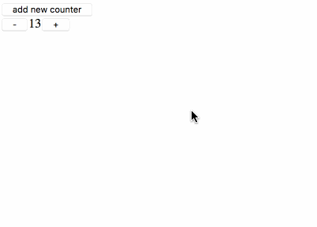

# incr_dom_reason

A project which demonstrates a Reason workflow with [incr_dom][https://github.com/janestreet/incr_dom].

It includes a basic counter example, that has been copied from the original [`incr_decr` example](https://github.com/janestreet/incr_dom/tree/f62ed08fbbc24a194a1b0297d6b241ee438c451c/example/incr_decr).

## Usage

You need Esy, you can install the beta using [npm][https://nodejs.org/en/download/]:

    % npm install -g esy@latest

Then you can install the project dependencies using:

    % esy install

Then build the project dependencies along with the project itself:

    % esy build

And test the compiled JS executable, open `index.html` in your browser:

